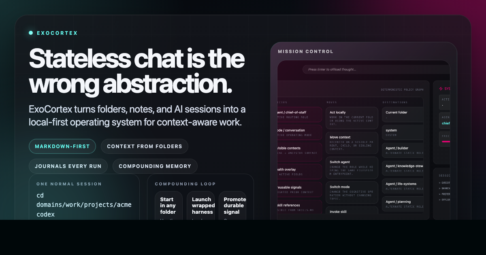
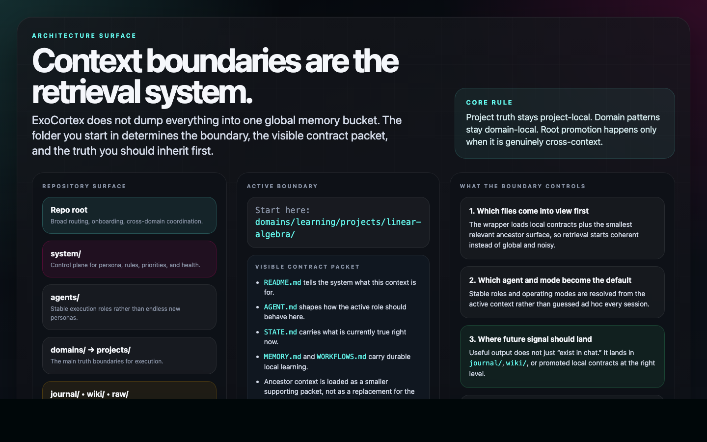
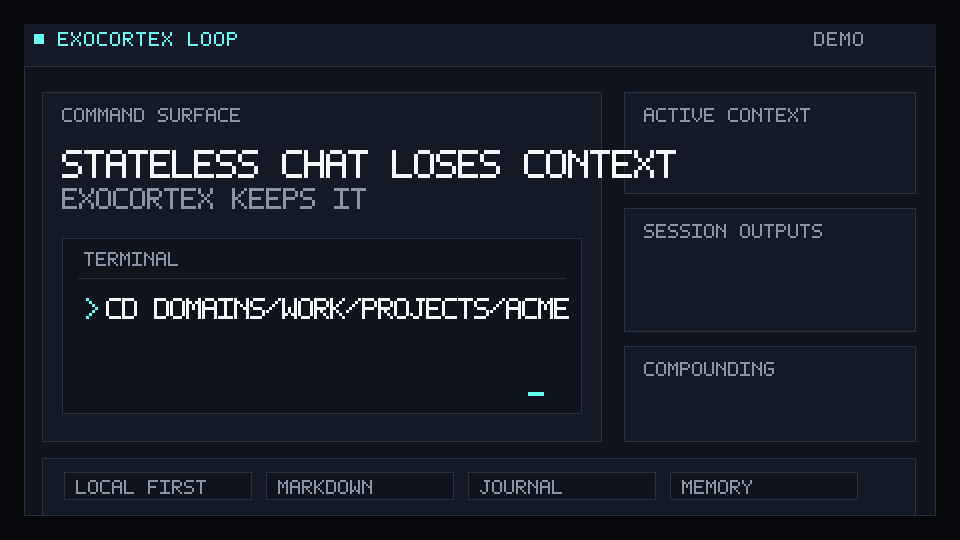
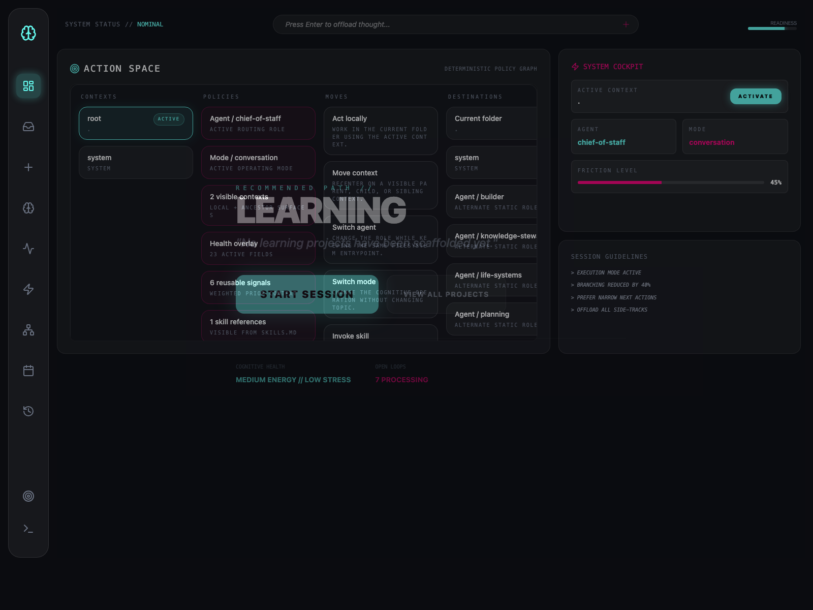

# ExoCortex



**Start anywhere. Compose the right context. Keep what compounds.**

ExoCortex is a composition-based cognitive infrastructure platform. It gives you a local system for context, notes, memory, workflows, review, and operating state that compounds over time with low ceremony. After setup, context loading, session capture, and journaling happen automatically in the background while the resulting state stays visible and inspectable. It can launch and capture sessions through `codex`, `claude`, and `gemini` today, but the infrastructure itself is harness-agnostic: you can change tool or model provider, and your system stays with you.

[Quickstart](#quickstart) • [What It Does](#what-it-does) • [Examples](docs/compositional-examples.md) • [Architecture](docs/technical-architecture.md) • [Agents](agents/README.md) • [One Session](#how-one-session-works) • [Repository Shape](#repository-shape) • [Current Status](#current-status) • [Docs](docs/README.md) • [First 5 minutes](docs/first-5-minutes.md)

## Read This First

Read these before the quickstart:

- [docs/compositional-examples.md](docs/compositional-examples.md)
- [docs/technical-architecture.md](docs/technical-architecture.md)
- [agents/README.md](agents/README.md)

That is where the project usually clicks.

## Composition At A Glance

```text
task handling =
  context boundary
  x loaded context
  x agent
  x mode
  x rules
  x skills
  x tools
  x durable state
```

ExoCortex does not rely on one giant persona. It composes stable parts.



Where you stand in the repo determines the context boundary, the contract packet, and the truth surface that should come into view first.

## What The Core Files Mean

These files are not duplicates. Each one holds a different kind of truth:

- `README.md`: what this context is, what it is for, and how to orient yourself inside it
- `AGENT.md`: how the active role should behave here; this is the local execution stance
- `STATE.md`: what is true right now; active work, current constraints, live focus, known blockers
- `MEMORY.md`: durable lessons, heuristics, and preferences that should survive many sessions
- `WORKFLOWS.md`: repeatable procedures that proved useful and should be reused
- `SKILLS.md`: references to reusable capability packages or special methods the context should know about
- `DECISION RULES.md`: explicit constraints, preferences, and routing rules such as "prefer X", "never do Y silently", or "ask before Z"

They contribute differently during runtime:

- `README.md` and `AGENT.md` help the system orient and behave correctly at startup.
- `STATE.md` helps it avoid starting from stale assumptions.
- `MEMORY.md`, `WORKFLOWS.md`, `SKILLS.md`, and `DECISION RULES.md` help it start from better accumulated judgment rather than from zero.

They also receive different kinds of promotion:

- If a session discovers something temporary but operationally important, it usually belongs in `STATE.md`.
- If it discovers a durable lesson or preference, it belongs in `MEMORY.md`.
- If it discovers a sequence that works reliably, it belongs in `WORKFLOWS.md`.
- If it discovers a stable constraint or policy, it belongs in `DECISION RULES.md`.
- If it points to a reusable capability package, helper method, or specialized toolkit, it belongs in `SKILLS.md`.
- If it is managed knowledge rather than operating guidance, it may belong in `wiki/` instead.

That is how promotions stay legible. The system does not just "remember more." It sorts the right kind of signal into the right kind of file.

## Why This Exists

Most systems break in the same place:

- context is scattered across repos, notes, chat history, and your head
- useful sessions and decisions vanish after they end
- learning does not reliably feed back into future work
- workflows stay implicit instead of becoming reusable infrastructure

ExoCortex exists to fix that with a harder constraint: keep the important state local, readable, and durable. The filesystem stays visible. Markdown stays authoritative. The goal is lower re-orientation cost, better continuity, and a system that helps you improve the way you think, learn, and work.

## What This Lets You Do

- Notice a pattern while solving a coding problem and realize it echoes something you read in philosophy three months ago, because both lines of thought now live in the same durable system instead of in separate dead silos.
- Re-enter a product repo after a week of chaos and start from the actual current context instead of spending 40 minutes reconstructing what was true, what was blocked, and what you were about to do.
- Move between levels of abstraction on demand: jump from raw source captures, to wiki overviews, to concept pages, to deeper analyses, and then back into the live task with the right layer of understanding for the moment.
- Turn one good debugging session into a better future default, because the fix, the reasoning, and the workflow can be promoted into local memory and reused the next time the same class of failure appears.
- Have research, planning, implementation, and review reinforce each other instead of resetting between tools, tabs, and chats.
- Have the system realize you are solving the wrong way because your state is wrong, not because you are bad at the task: a health overlay informed by check-ins, sleep debt, or eventually wearable signals can narrow scope, reduce branching, change pacing, and push you toward the next action that matches your actual capacity.
- Watch cross-domain ideas emerge on their own: something from health, writing, strategy, or learning changes how you approach engineering, and that connection is recoverable later instead of being a fleeting lucky thought.
- Notice that a pattern you found while coding also solves a personal-life problem: queue pressure, retry logic, narrow interfaces, or error budgeting stop being just engineering concepts and become usable operating ideas elsewhere in your life.
- Keep ordinary work from disappearing. A useful session can come back later as journal state, review queues, candidate promotions, stronger workflows, and better startup context.

## Worked Example

Suppose you want a `linear algebra` teacher that improves over time.

```text
domains/
  learning/
    projects/
      linear-algebra/
        README.md
        AGENT.md
        MEMORY.md
        STATE.md
        WORKFLOWS.md
        wiki/
```

That system can be composed like this:

- **Context**: `domains/learning/projects/linear-algebra/`
- **Agents**: `research` + `planning` + `knowledge-steward`
- **Modes**: ingestion + synthesis + conversation
- **Rules**: prefer primary sources, separate intuition from formalism, promote only stable concepts
- **Skills and workflows**: source ingestion, lesson planning, exercise generation, misconception tracking
- **Tools**: wrapped sessions, source captures in `raw/`, project `wiki/`, `journal/`
- **Durable outputs**: concept pages, lesson outlines, exercises, review queues, improved teaching workflows

That matches the current project contract: `README.md`, `AGENT.md`, `MEMORY.md`, `STATE.md`, and `WORKFLOWS.md` are core, while `wiki/` is optional when the project needs managed synthesis.

The role set stays stable. The result changes because the composition changes.
For more examples, read [docs/compositional-examples.md](docs/compositional-examples.md).

## Quickstart

Before you start:

- Python 3 is required for the wrapper runtime and journal worker.
- At least one real harness CLI must already be installed and working: `codex`, `claude`, or `gemini`.
- `./tools/wrappers/install.sh` targets `zsh`. If you use another shell, call the wrappers directly from `tools/wrappers/bin/`.
- Node.js and `tools/mission-control/backend/requirements.txt` are only needed for the optional Mission Control UI.

### 1. Initialize the clone

```bash
python3 tools/bootstrap/init.py
```

Or, after the wrapper bin is on `PATH`:

```bash
exocortex-init
```

This restores missing runtime scaffold files and seeds review queues, raw buckets, and root wiki files.

### 2. Put the wrappers on your `PATH`

```bash
./tools/wrappers/install.sh
```

If you do not want to edit your shell yet, call the wrappers directly from `tools/wrappers/bin/`.

### 3. Install low-risk background automation

```bash
./tools/automations/install_cron.sh
```

This installs the reporting-only ExoCortex cron job documented in `system/CRONJOBS.md`. It refreshes automation status on a schedule and is part of the intended onboarding path.

If you prefer to do setup in one command, you can also run:

```bash
python3 tools/bootstrap/init.py --install-wrappers --install-cron
```

### 4. Verify the wrapper layer

```bash
exocortex-doctor
```

What you want to see:

- `wrapper_bin_on_path: ok`
- `authoritative_preload: ok`
- `[ok] codex`, `[ok] claude`, or `[ok] gemini` for the harness CLI you actually installed

If those checks pass, ExoCortex is in the execution path and can inject context before the real harness starts.

### 5. Start from the right folder

- repo root for broad conversation and routing
- domain folders for domain work
- project folders for execution
- agent folders when you want a local role contract to dominate

### 6. Launch a wrapped session

```bash
codex
```

Or:

```bash
claude
```

Or:

```bash
gemini
```

If the wrappers are not on `PATH` yet, run the matching command from `tools/wrappers/bin/`.

### 7. Confirm that it wrote artifacts

After one wrapped run, inspect `journal/`. Typical artifacts include:

```text
journal/sessions/YYYY-MM-DD/<session-id>.json
journal/sessions/YYYY-MM-DD/<session-id>.context.md
journal/sessions/YYYY-MM-DD/<session-id>.transcript.md
journal/sessions/YYYY-MM-DD/<session-id>.summary.md
journal/sessions/YYYY-MM-DD/<session-id>.candidates.json
journal/raw/YYYY-MM-DD.md
journal/summarised/YYYY-MM-DD.md
```

If those files exist, the core loop is working: the session started from explicit context and came back as reusable state.

### 8. Optional next steps

Open the repo as an Obsidian vault if you want a better browsing experience, or scaffold a new domain or project:

```bash
exocortex-init domain research
exocortex-init project work my-project
```

## What It Does

ExoCortex is three things working together:

- A filesystem-native context system built from folders and markdown contracts such as `README.md`, `AGENT.md`, and `STATE.md`.
- A journaling and review loop that turns work into files you can inspect, revisit, and promote later.
- A tool-entry layer that can launch wrapped `codex`, `claude`, and `gemini` sessions inside that context without making the architecture dependent on a single harness.

The point is simple: the tool is not the system. The system is the local structure around it.

## How One Session Works

1. Start in the repo root, a domain folder, or a project folder.
2. Launch a wrapped harness such as `codex`, `claude`, or `gemini`.
3. ExoCortex loads local contract files plus the smallest relevant ancestor context.
4. You work normally in the terminal.
5. The run is written back into `journal/` as artifacts.
6. Useful patterns can later be promoted into durable files at the right level.




## What Compounds Over Time

- Repeated themes can surface in daily summaries, weekly synthesis, and review queues.
- Future sessions can start with reusable context from earlier work instead of resetting to zero.
- Restarting work gets easier because decisions, notes, and follow-ups are already in the repo.
- The system can gradually become a better model of how you work, learn, decide, and recover context.

## Mission Control

ExoCortex also includes an optional Mission Control UI in `tools/mission-control/`.



The radar view makes the active context, policies, available moves, and destinations inspectable without turning the UI into a second source of truth.

Use it to inspect what is active before or between runs:

- active contexts
- likely next moves
- recent activity
- open loops
- wrapped run launch

The UI is not the source of truth. Durable state stays in markdown under the main repo hierarchy.

## Repository Shape

```text
ExoCortex/
  system/      persona, rules, health, priorities, open loops
  agents/      stable working roles
  domains/     durable areas of life and work
  journal/     session history, summaries, queues, weekly synthesis
  raw/         source material
  skills/      reusable capabilities
  wiki/        durable notes and synthesis
  tools/       wrappers, workers, prompts, mission control
```

## Current Status

Implemented now:

- wrapped `codex`, `claude`, and `gemini` entrypoints
- hierarchical context discovery from folder location
- startup context manifests built from root, system, and current-scope files
- session manifests, context snapshots, and streamed transcripts
- daily journal output, summaries, candidate extraction, review queues, and weekly synthesis
- reusable context injection for later sessions
- optional Mission Control UI and backend
- smoke tests across the core wrapper and worker path

Still early:

- shell installation should become more automatic
- promotion and retrieval should become stronger
- add markdown-native retrieval, likely with `qmd`, so agents can query growing markdown state instead of relying only on direct text loading as the document set grows
- health and external-signal automation is still immature

## Good Fit, Bad Fit

ExoCortex fits best if you want:

- a local, inspectable, file-based cognitive infrastructure
- one environment for planning, execution, reflection, synthesis, and workflow learning
- a system that gets better through ordinary use

It fits poorly if you want:

- a polished hosted SaaS product
- hidden automation with unclear state transitions
- a system that abstracts away the filesystem entirely

## Read Deeper

- [docs/README.md](docs/README.md) for the visual docs landing page
- [docs/first-5-minutes.md](docs/first-5-minutes.md) for the shortest practical onboarding walkthrough
- [docs/technical-architecture.md](docs/technical-architecture.md) for the system model: entities, relationships, agents, skills, tools, and composition
- [docs/compositional-examples.md](docs/compositional-examples.md) for concrete examples of how the same parts can be composed into things like a teacher, accountant, editor, or research engineer
- [agents/README.md](agents/README.md) for the stable role set and why it stays intentionally small
- [tools/wrappers/README.md](tools/wrappers/README.md) for the wrapper layer
- [journal/README.md](journal/README.md) for the journaling and review loop
- [wiki/00_meta/Operating Contract.md](wiki/00_meta/Operating Contract.md) for managed wiki and raw-ingestion rules
- [wiki/04_analyses/ExoCortex system architecture.md](wiki/04_analyses/ExoCortex system architecture.md) for the deeper architecture writeup
