# ExoCortex

> *"The better we get at getting better, the faster we will get better."*
> — Douglas Engelbart

**ExoCortex is the outer loop around your AI** — it captures your work, decides what deserves your attention next, and compounds it into shipped output. The bet underneath is that allocating attention is a decision problem you can learn, with your own dopamine as the reward signal. Stated the way the system actually runs it:

$$\pi^{\star} = \arg\max_{\pi} \mathbb{E}_{\pi}\left[\int_{0}^{\infty} e^{-\rho t} r_t \thinspace dt\right] \qquad \text{where} \qquad r_t = d_t \cdot \mathbf{1}[\text{shipped}_t]$$

Symbol by symbol:

- $\pi^{\star}$ — the policy you're solving for: the rule that decides what to surface or do next.
- $\arg\max_{\pi} \mathbb{E}_{\pi}[\cdots]$ — pick the policy that maximizes the *expected* total reward.
- $\int_{0}^{\infty} \cdots dt$ — accumulated over all future time, from now ($0$) onward.
- $e^{-\rho t}$ — a discount: reward sooner counts for more than reward later. $\rho$ sets how steeply, and it's what keeps the infinite sum finite.
- $r_t = d_t \cdot \mathbf{1}[\text{shipped}_t]$ — the reward is your dopamine $d_t$, but only when a thought ships as a finished artifact ($\mathbf{1}[\cdots]$ is the gate: $1$ if you shipped, $0$ if not).

That gate is the whole point: drop it and you've built a slot machine. (Dopamine is, precisely, the reward-prediction error the policy learns from — Schultz, Dayan & Montague, 1997.)

Underneath the equation is the principle the whole thing is built on: attention is the one resource you can't make more of. Your tools, your time, your AI — they pay off only through what you point your attention at. So the goal was never to *do more*; it's to *aim better* — the most finished output for the least, best-directed attention. Every other question — what to learn, what to build, what to ship — reduces to that one allocation, and aiming it is the whole job ExoCortex does. The biggest waste it kills is re-orientation: the forty minutes you burn reloading a project into your head before you can even start, every time you switch. Open a session and the context is already composed — you start the task, not the reload.

A feed optimizes that same signal for consumption. ExoCortex optimizes it for production, and it pays out only when you finish something real — an essay, a tool, a commit. The reward isn't the hit; it's the thought that survived being written down.

That constraint is the point. Forcing a vague idea into words is what shows you whether you actually have one — writing has a built-in BS detector. So ExoCortex keeps the friction that makes you sharper and strips the friction that only wastes you. It won't think *for* you; it makes thinking cheaper to start and worth finishing.

A feed removes all the effort, and you learn nothing. An assistant that thinks for you removes the effort that matters, and you atrophy — [the evidence is mounting](REFERENCES.md). ExoCortex is built for the opposite — augmentation, not atrophy. Anti-rot, by design. Built first for one real person, and open to anyone wired the same way.

<p align="center">
  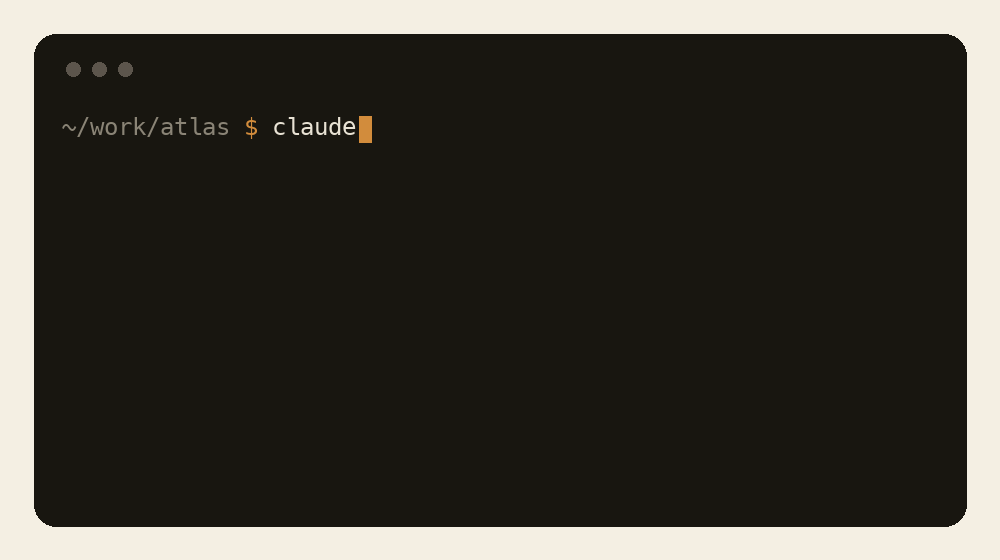
</p>

The biggest tax it kills is re-orientation — the time you burn reloading a project into your head before you can even start.

<p align="center">
  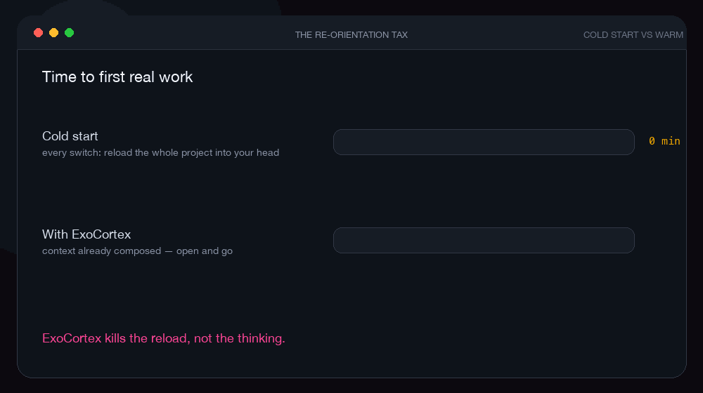
</p>

## How it works

Your AI is brilliant inside a single session and forgets you the moment the chat closes. ExoCortex runs the loop around it, in five stages: it works out what deserves your attention next, composes the right context for it, captures what happened while you worked, keeps what's worth keeping, and helps you ship it. Then it comes back around a little sharper.

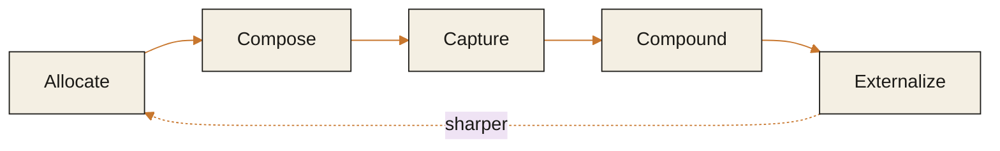

<p align="center">
  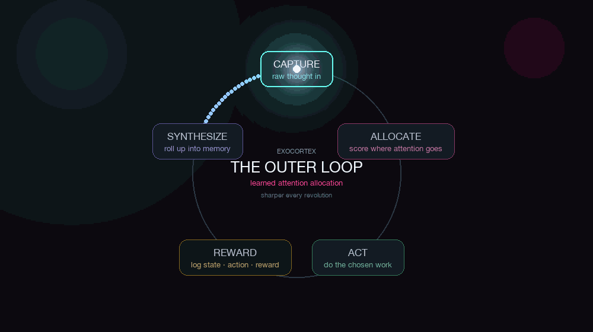
</p>

Up close, one session runs the whole pipeline end to end — plain files in, durable memory out, and the next session opens already oriented.

<p align="center">
  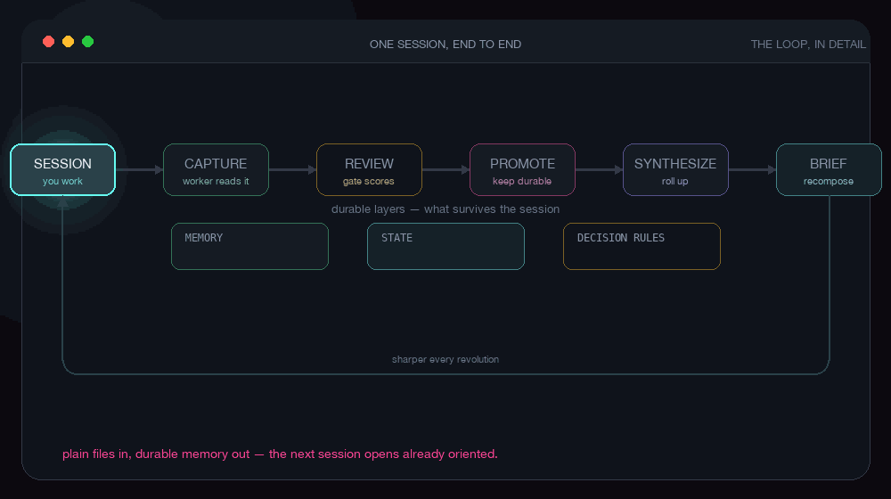
</p>

Underneath, it runs on a small, fixed set of roles: chief-of-staff, planning, research, builder, reviewer, knowledge-steward, life-systems. Most real work breaks down into the same handful of functions whatever the domain.

The trick is that behavior is **composed, not stored**. There's no zoo of named agents to maintain — just a few stable parts that combine on demand: `scope × role × mode × rules × skill`. Where you are sets the scope, the role sets the stance, your rules set the guardrails, and the task selects the skill. Those dials settle to different values and synthesize the right agent for the moment — a PR reviewer, your essayist, a planner for a launch — then it dissolves when the task is done. The parts stay; the agent is made fresh each time. The set stays small while what it can do keeps growing.

<p align="center">
  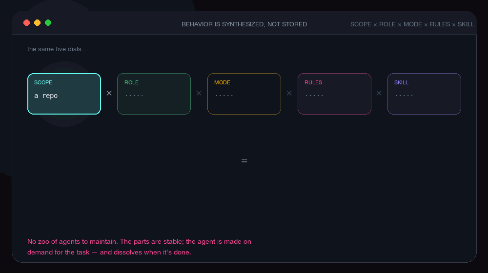
</p>

It also keeps kinds of knowledge apart. A decision you made, a condition that's true today, and a standing rule are stored as different types, because they age and apply differently — a rule holds until you change it, a condition goes stale in a day. That typing is what lets the system load the right thing at the right moment and act on it safely, instead of dropping one undifferentiated pile of notes into every prompt. It's the line between a system that knows what it knows and a blob you have to re-read.

## What you can do with it

- Catch every idea the moment it lands, so nothing dies in a chat log overnight.
- Open your work and know where you are in seconds, from a short brief that's already waiting.
- Ask what to do next and get a real answer, drawn from how you actually work.
- Turn the pile of half-finished things into finished, shipped work.
- Keep all of it in plain files you can read, edit, delete, and carry to any model.

## See it work

Five parts of the loop, each a real command and its real output — not invented CLI text.

**The allocator decides.** It scores the moves competing for your attention and shows the math behind the pick. This is the part that makes ExoCortex an allocator, not a notes app: where to aim next is computed, not guessed.

<p align="center">
  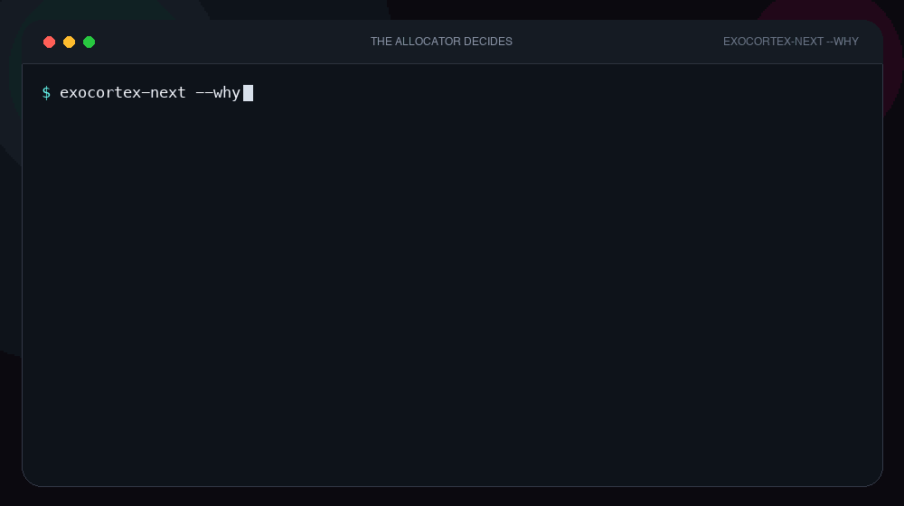
</p>

**The reward loop closes.** Every session ends with one rating, written as a labeled row — state, action, reward. That's a training set for the allocation policy, accumulating from day one.

<p align="center">
  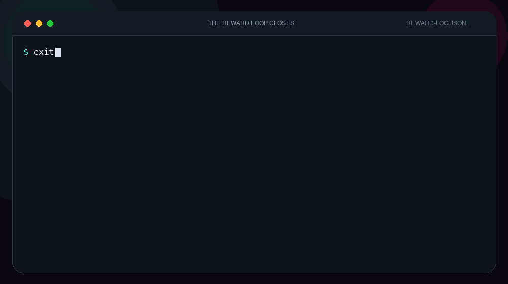
</p>

**Capture to ship.** A raw thread is tracked from captured to shaped to shipped, and surfaces in your brief along the way, so nothing finished quietly gets lost.

<p align="center">
  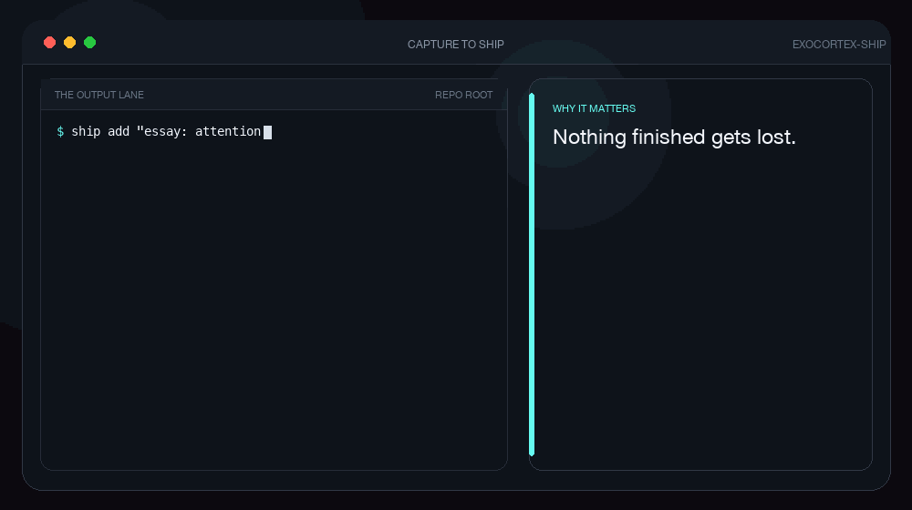
</p>

**Triaged at scale.** Hundreds of pending candidates get expired, surfaced, and closed in a single pass, so the backlog stays a tool instead of a guilt pile.

<p align="center">
  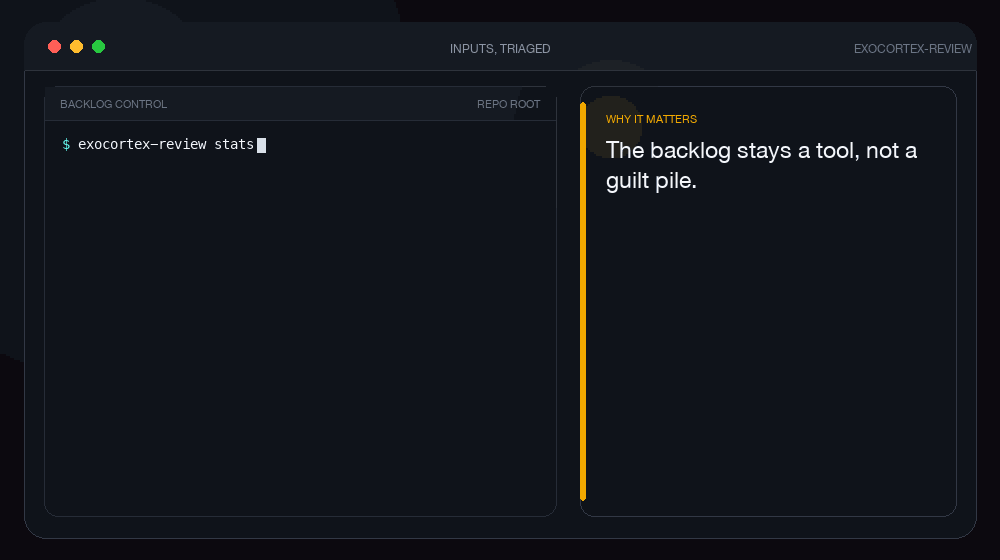
</p>

**It synthesizes itself.** Raw sessions roll up into weekly and monthly memory on their own, so the system stays legible as it grows.

<p align="center">
  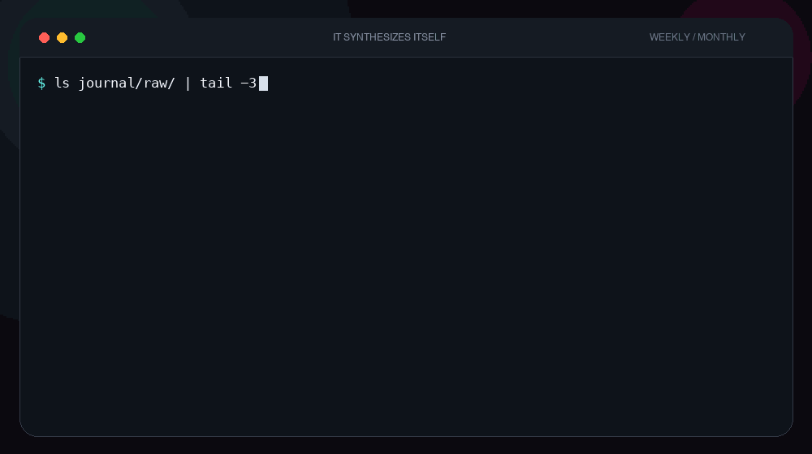
</p>

## How you use it

You talk to it. Open a session the way you already do, with `claude`, `codex`, or `gemini`, and ExoCortex composes the right context around it and writes the result back when you're done. It works in the background and asks one short question at the end. The commands underneath are there when you want them; otherwise, leave them alone.

## Quickstart

You need Python 3 and at least one working AI CLI (`codex`, `claude`, or `gemini`).

```bash
git clone https://github.com/chrisgks/exocortex-core.git
cd exocortex-core
pip install -e .                 # installs the exocortex-* commands
exocortex-init instance ~/my-exo # scaffold your own private instance
cd ~/my-exo
claude                           # or codex, or gemini — a wrapped session
```

That gives you a running instance: your own data directory, in plain markdown, that the engine reads and writes. The engine is the installed package; the instance is yours and private. More on that split is in [the architecture guide](docs/technical-architecture.md#engine-and-instance).

## Who it's for

You don't have a focus problem. You have more ideas than one head can hold. ExoCortex catches the overflow and turns it into finished work.

**This is for you if:**

- you've got more browser tabs open than you'll admit, and closing one feels like burning the Library of Alexandria
- your best thought this week is in a chat you can't find
- "I'll write that down later" is the biggest lie you tell yourself
- you're allergic to busywork but desperate for your work to add up to something

**This is not for you if:**

- you want the AI to do the thinking so you don't have to — this one makes you do the thinking, just faster, and without the busywork
- your inbox is at zero. Genuinely, we're a little scared of you
- you've never once lost an idea. (Also: we don't believe you)
- you think the fix is just more discipline
- you've ever built "a system" and actually stuck to it past week two
- your browser doesn't beg for mercy when it starts up
- you have one browser tab open. *How*
- you read this far and related to none of it — congratulations, genuinely, go outside

Past the jokes: ExoCortex is a local, inspectable system you own — plain text on your machine, not a hosted app with a polished UI that hides the filesystem from you. If you want managed-and-magic, this isn't it. If you want to own the thing, it is.

## Current status

The loop runs today. Sessions are captured (whether or not you launch through the wrapper), the daily brief is built for you at startup, suggestions come from the allocator, and nothing is written to your durable files without your say. Every change is recorded and reversible.

Still a bet, and named as one: the allocator that decides what to surface is hand-written today and logs everything so it can be learned later; sharing what the system learns across machines is a direction, not a feature; and markdown-native search and health signals are early. The honest, detailed split is at the end of [the architecture guide](docs/technical-architecture.md#status).

## Where it comes from

The lineage is Bush's Memex, Licklider's symbiosis, Engelbart's augmentation, and Clark and Chalmers on the extended mind, joined to the modern understanding of dopamine as a reinforcement signal and the reinforcement-learning that grows out of it. The full set of sources is in [REFERENCES.md](REFERENCES.md).

## A note on what this is

This is personal infrastructure. I built it because I needed it — I'm the one real person it was built for — and I put it in the open in case you needed it too. It isn't a product, there's no roadmap I'm promising you, and I'm not trying to grow anything. It's the thing I actually use, shared honestly, in case a similar soul comes looking and is glad to find it.

## Read more

- [Architecture guide](docs/technical-architecture.md) — how it works, how to operate it, the engine/instance split, the design, and the references.
- [Contributing](CONTRIBUTING.md) · [Security](SECURITY.md) · [Code of conduct](CODE_OF_CONDUCT.md) · [License](LICENSE)
