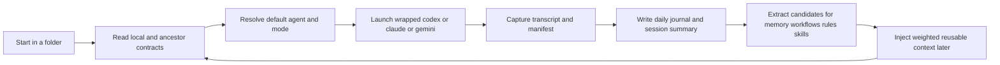
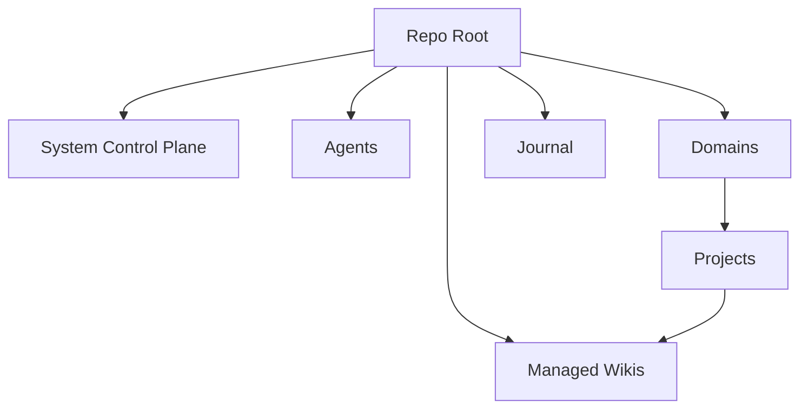
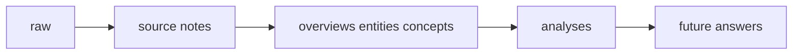

# ExoCortex Docs

This page is the visual tour of ExoCortex.

Use the root [../README.md](../README.md) for the product overview and quickstart. Use this page when you want the screenshots, loop visuals, and architecture posters in one place.

## Start Here

- Start with [../README.md](../README.md) if you have not read the main landing page yet.
- Read [compositional-examples.md](compositional-examples.md) if you want the composition model to become concrete.
- Read [first-5-minutes.md](first-5-minutes.md) if you want the shortest path to one working loop.
- Read [technical-architecture.md](technical-architecture.md) if you want the system model.

## Demo Loop

  

The loop above is the core promise:

1. Start in the right folder.
2. Launch a wrapped harness.
3. Capture the session and write the journal.
4. Promote durable signal.
5. Make the next session better.

## Real Terminal Walkthrough

  

This is based on real command output from this repo:

- `./tools/wrappers/install.sh`
- `exocortex-doctor`
- `codex --help` through the ExoCortex wrapper

## Key Screens

### Launch / Open Graph

  

### Mission Control

  

The radar view shows the live action surface: current context, routing policy, available moves, and likely destinations.

### Agent Forge

  

The roster stays explicit. Stable agents are part of the architecture, not hidden prompt folklore.

## Visual Architecture

### Context Boundaries

  

This is the core retrieval rule: folder location determines boundary, boundary determines visible contracts, and visible contracts determine what truth comes into scope first.

### Compounding Loop

  

This is the core systems claim: the work compounds because durable output lands back in inspectable files.

## Architecture At A Glance

### Session Compounding Loop

### Context Hierarchy

### Managed Knowledge Model

## What To Read Next

- [../README.md](../README.md) for the GitHub landing page and quickstart
- [compositional-examples.md](compositional-examples.md) for real-world examples such as teacher, accountant, research engineer, and editor compositions
- [first-5-minutes.md](first-5-minutes.md) for the shortest practical onboarding path
- [technical-architecture.md](technical-architecture.md) for the technical model: entities, relationships, agents, skills, tools, and composition
- [../agents/README.md](../agents/README.md) for the agent registry and role rationale
- [../tools/wrappers/README.md](../tools/wrappers/README.md) for wrapper behavior
- [../journal/README.md](../journal/README.md) for the compounding journal loop
- [../wiki/04_analyses/ExoCortex system architecture.md](../wiki/04_analyses/ExoCortex system architecture.md) for the deeper architecture writeup
- [../wiki/04_analyses/Obsidian vaults and managed wikis.md](../wiki/04_analyses/Obsidian vaults and managed wikis.md) for wiki topology

## What ExoCortex Is Not

- not a generic multi-agent playground
- not a hosted note app with opaque memory
- not a black-box memory system
- not optimized for people who never want to read the underlying files

It is optimized for people who want context, state, and cognition to stay inspectable.
