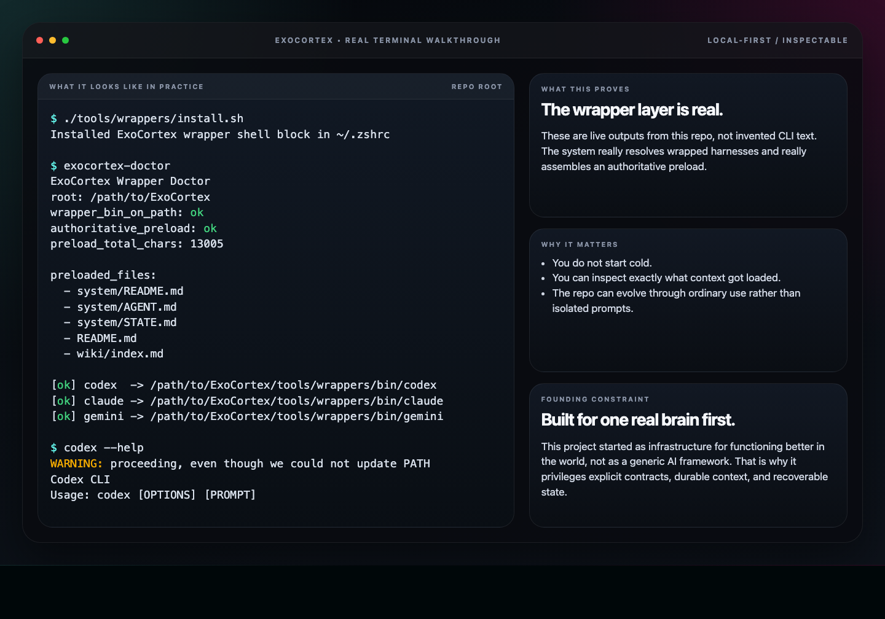
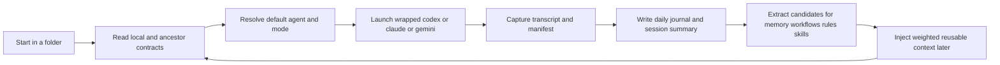
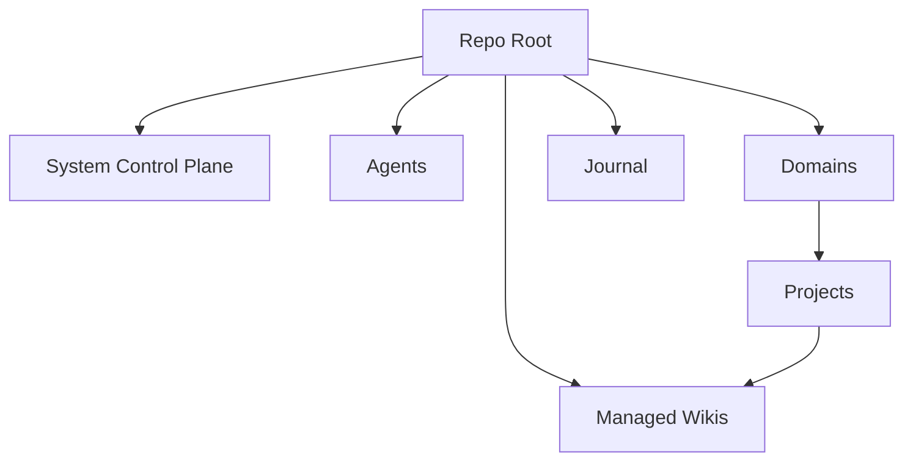
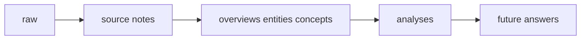

# ExoCortex Docs

ExoCortex started as a personal system before it became an open-source repo.

The original constraint was simple: build something that helps one person function in the world with this brain. That constraint is why the project is so opinionated about local state, explicit structure, markdown contracts, durable context, quiet background automation, and a harness-agnostic architecture.

If that problem feels familiar, start here.

## Start Here

- Read [compositional-examples.md](compositional-examples.md) first. That is where the composition model becomes concrete.
- If you want to get the loop running, read [first-5-minutes.md](first-5-minutes.md).
- If you want the technical model, read [technical-architecture.md](technical-architecture.md).
- If you want the stable role set, read [../agents/README.md](../agents/README.md).

## Demo Loop

  

The loop above is the core promise:

1. Start in the right folder.
2. Launch a wrapped harness.
3. Capture the session and write the journal.
4. Promote durable signal.
5. Make the next session better.

## Real Terminal Walkthrough

  

This is based on real command output from this repo:

- `./tools/wrappers/install.sh`
- `exocortex-doctor`
- `codex --help` through the ExoCortex wrapper

## Key Screens

### Launch / Open Graph

  

### Mission Control

  

Mission Control is a view onto the system, not the system itself. The source of truth stays in markdown.

## Architecture At A Glance

### Session Compounding Loop

### Context Hierarchy

### Managed Knowledge Model

## What To Read Next

- [../README.md](../README.md) for the GitHub landing page and quickstart
- [compositional-examples.md](compositional-examples.md) for real-world examples such as teacher, accountant, research engineer, and editor compositions
- [first-5-minutes.md](first-5-minutes.md) for the shortest practical onboarding path
- [technical-architecture.md](technical-architecture.md) for the technical model: entities, relationships, agents, skills, tools, and composition
- [../agents/README.md](../agents/README.md) for the agent registry and role rationale
- [../tools/wrappers/README.md](../tools/wrappers/README.md) for wrapper behavior
- [../journal/README.md](../journal/README.md) for the compounding journal loop
- [../wiki/04_analyses/ExoCortex system architecture.md](../wiki/04_analyses/ExoCortex system architecture.md) for the deeper architecture writeup
- [../wiki/04_analyses/Obsidian vaults and managed wikis.md](../wiki/04_analyses/Obsidian vaults and managed wikis.md) for wiki topology

## What ExoCortex Is Not

- not a generic multi-agent playground
- not a hosted note app with opaque memory
- not a black-box memory system
- not optimized for people who never want to read the underlying files

It is optimized for people who want context, state, and cognition to stay inspectable.
