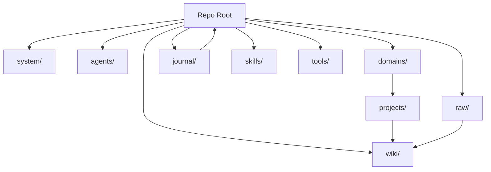
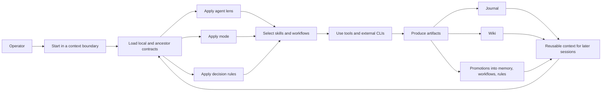
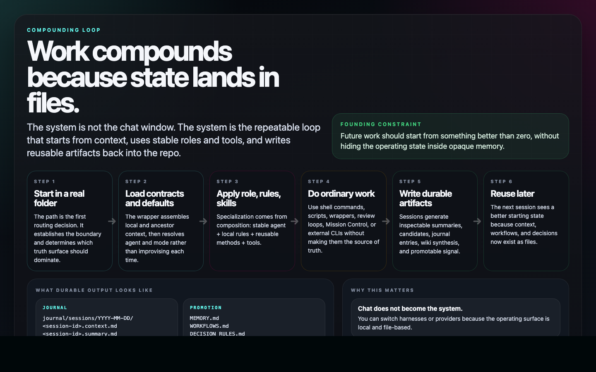
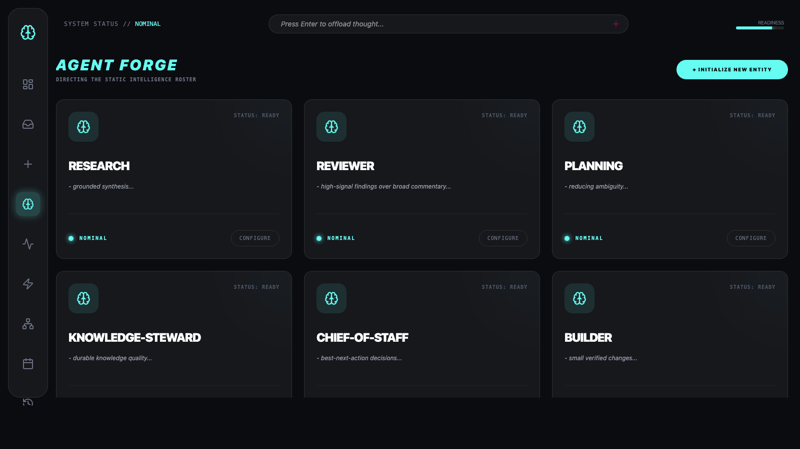

# Technical Architecture

This page explains ExoCortex as a system, not as a collection of claims.

The short version:

ExoCortex is a local, file-based cognitive infrastructure platform. It uses explicit context boundaries, stable roles, reusable skills, ordinary tools, and durable state so work compounds instead of resetting. After setup, context loading, session capture, and journaling happen automatically in the background, but the resulting state remains file-based and inspectable.

See also:

- [compositional-examples.md](compositional-examples.md) for concrete "teacher", "accountant", and other real-world compositions

## System At A Glance

The repository is not just storage. It is the operating surface.

The visual above is the practical version of the repo diagram: context boundaries decide what comes into view first, what stays local, and where later signal should land.

## Composition Flow

That is the composition model:

`task handling = context boundary x loaded context x agent x mode x rules x skills x tools x durable state`

This is the operational claim in one frame: ordinary tool use is not enough by itself; the loop matters because the output is written back into reusable files.

## Core Entity Types

ExoCortex is built from a small set of entity types that stay separate on purpose.

### Context Entities

- **Root**: top-level operating surface for broad routing, review, and coordination
- **System**: global control plane for persona, rules, modes, health, and priorities
- **Domain**: durable area of work or life
- **Project**: narrower execution context inside a domain
- **Agent folder**: stable role definition
- **Subsystem**: special-purpose areas such as `wiki/`, `raw/`, or `tools/`

### Contract Entities

These files define what a context means:

- `README.md`: what this context is for
- `AGENT.md`: how the active role should behave here
- `STATE.md`: what is currently true right now
- `MEMORY.md`: durable learned heuristics and preferences
- `WORKFLOWS.md`: repeatable procedures
- `SKILLS.md`: reusable capability references
- `DECISION RULES.md`: constraints, routing logic, and preference rules

These are not duplicates. They hold different kinds of truth.

### Behavioral Entities

- **Agent**: stable execution role
- **Mode**: current operating stance
- **Skill**: reusable capability package
- **Workflow**: repeatable sequence of steps
- **Decision rule**: explicit constraint or policy

### Execution Entities

- **Wrapper**: entry layer that loads context before a tool starts
- **Worker**: post-session processing and extraction
- **Tool**: concrete execution mechanism such as shell, scripts, Mission Control, or external CLIs

### Durable State Entities

- **Journal**: session history, summaries, candidates, and review queues
- **Raw**: source material kept close to original form
- **Wiki**: managed synthesis and durable knowledge structure
- **Promoted context**: memory, workflows, and rules refined from repeated signal

## How The Pieces Connect

The important relationships are:

- Folder location determines the starting context boundary.
- Contract files define the local truth available at startup.
- The active agent provides a stable lens on the work.
- The mode changes stance without requiring a new role.
- Decision rules constrain routing and behavior.
- Skills and workflows provide reusable methods.
- Tools execute concrete actions.
- Journal, wiki, memory, workflows, and rules preserve what should outlive the session.

This is why ExoCortex is composition-based. A task is not solved by one giant persona. It is solved by combining the right context, role, stance, procedure, and tools.

Mission Control's radar view is a concrete expression of that model. It surfaces context, policies, moves, and destinations without pretending the UI itself is the underlying memory.

## Why Not Make A New Agent For Everything

Because that would destroy the clarity the system is trying to preserve.

If every recurring task became its own agent, three things would happen:

- the role set would explode into narrow personas
- the same method would be duplicated across many agents
- readers would stop being able to tell whether behavior came from the role, the context, the rules, or the tools

ExoCortex avoids that by keeping agents stable and letting composition do the specialization.

Examples:

- "teacher" is usually `research` + `planning` + `knowledge-steward` in a learning context
- "accountant" is usually `life-systems` + `planning` + `reviewer` with finance rules and workflows
- "research engineer" is usually `research` + `builder` + `reviewer` inside a project context

The new capability comes from the composition, not from inventing a new permanent persona every time.

## Why Static Agents

ExoCortex uses a small set of stable agents because most serious work decomposes into recurring functions, not endless one-off personas.

Current agents:

- `chief-of-staff`: orchestration, prioritization, and routing
- `planning`: turning goals into executable plans and handoff structure
- `research`: gathering, comparing, and synthesizing evidence
- `builder`: implementing and verifying changes in real code or technical systems
- `reviewer`: adversarial review and quality control
- `knowledge-steward`: maintaining managed knowledge layers and source ingestion
- `life-systems`: life admin, routines, logistics, and personal operating systems

These were selected because they map to durable classes of work that recur across contexts. They are broad enough to generalize, but specific enough to produce different behavior.

The live roster view makes the design choice visible: the system keeps a small stable agent set and relies on composition for specialization.

## Why This Generalizes

The system does **not** claim that one fixed list of agents magically solves every task.

The claim is narrower and stronger:

- most tasks can be decomposed into recurring work functions
- those functions stay stable across domains
- the specifics come from context, mode, skills, rules, and tools

That is why ExoCortex prefers stable roles plus local context over project-specific personas.

Examples:

- a research-heavy coding task may combine `research` + `builder` + project-local context + review skill
- a strategic planning task may combine `chief-of-staff` + `planning` + root context + current priorities
- a source-ingestion task may combine `knowledge-steward` + wiki contract + raw material + synthesis workflows

The role stays stable. The work changes because the surrounding structure changes.

## Agents, Skills, Rules, and Tools

These layers do different jobs:

- **Agents** answer: what kind of work is this?
- **Modes** answer: what stance should the system take right now?
- **Decision rules** answer: what must or should constrain behavior?
- **Skills** answer: what reusable capability or procedure should be applied?
- **Tools** answer: what concrete mechanism executes the work?

Examples:

- `builder` may use a code-review skill, local decision rules, shell tools, tests, and repository scripts
- `research` may use source-ingestion workflows, comparison templates, and managed wiki rules
- `chief-of-staff` may use review queues, state files, and planning workflows

This separation matters:

- if skills were agents, the role set would explode
- if tools were the system, the repo would lose durable structure
- if context were global, retrieval would get noisy and unreliable
- if rules were implicit, behavior would drift and become hard to inspect

## Modes vs Agents

Modes exist so the system can change behavior without inventing a new role.

An agent says what function is being performed.
A mode says how that function is being performed right now.

Examples from the current system include conversation, ingestion, processing, compression, application, and synthesis.

That split matters for composition. A `research` agent in synthesis mode should not behave like `research` in ingestion mode, and neither requires creating a new role.

## Why Context Boundaries Matter More Than Agent Boundaries

ExoCortex treats context boundaries as primary.

That means:

- project truth should usually stay project-local
- domain patterns should usually stay domain-local
- root knowledge should be promoted only when it is genuinely cross-context
- agents can work across many contexts without owning the knowledge boundary itself

This is why the repo separates agents from managed wiki scope. Agents are execution lenses. Contexts are truth boundaries.

## Why The Files Matter

The files are not decoration around the runtime. They are the runtime's inspectable memory and control surface.

That brings several benefits:

- humans can read and edit the system directly
- diffs make state changes legible
- context can be promoted gradually instead of dumped into opaque memory
- different tools can share the same underlying operating surface

The UI and wrappers are useful, but they are not the underlying memory.

## Minimal Mental Model

If you only remember one technical idea, use this:

ExoCortex is not a chatbot with extra notes.
It is a composable local system where stable roles, explicit context, reusable skills, rules, and durable files work together so future work starts from something better than zero.
