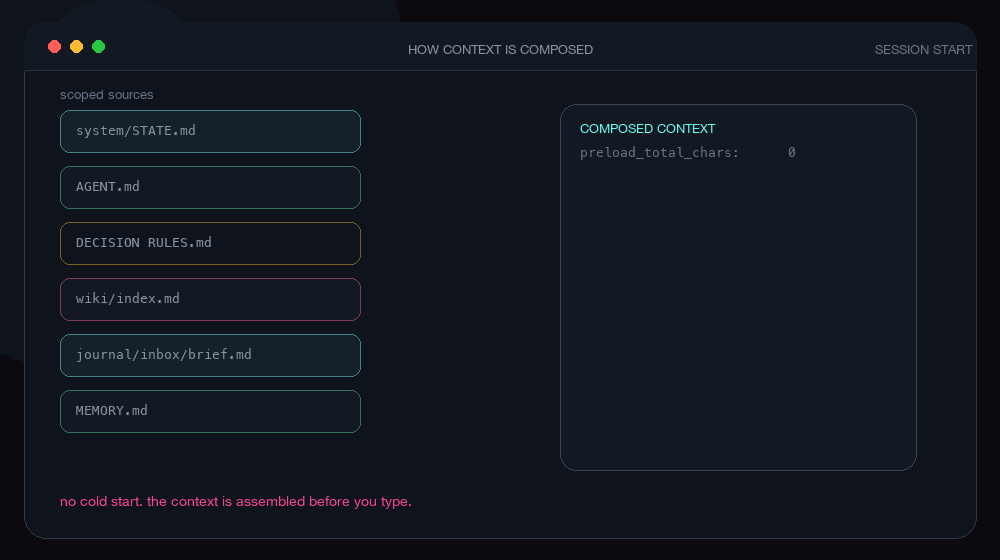
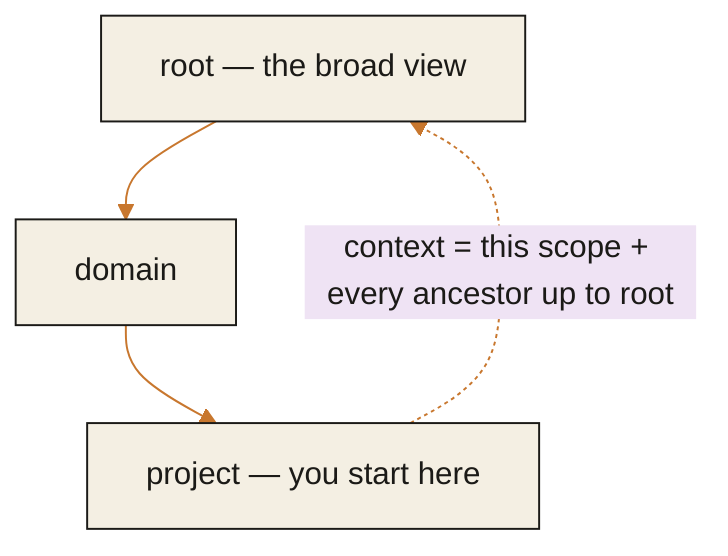
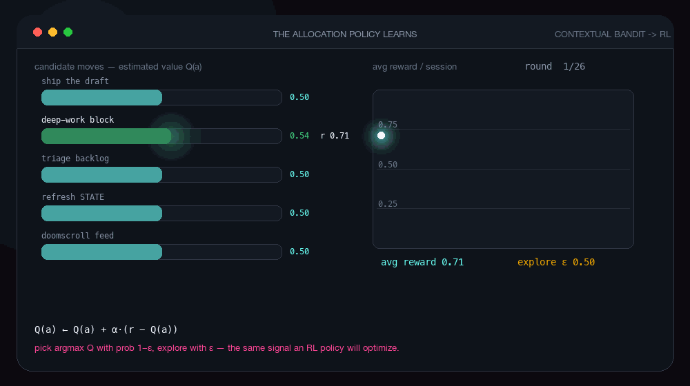
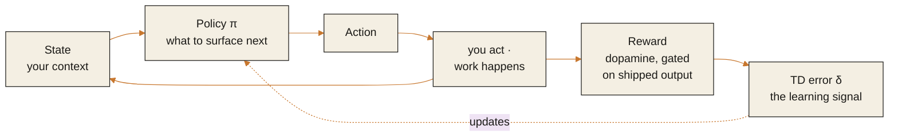

# Architecture guide

This is the one deep document. The README says what ExoCortex is and why you'd use it; this says how it works, how to operate it, how it's built, and where the ideas come from. Read it straight through, or jump to a section.

## The shape

Your AI is an inner loop. Inside a single session it searches, reasons, and solves, relentlessly. The moment the session ends, it forgets you.

ExoCortex is the outer loop — the part that lives across sessions. It works out what you should do next, composes the right context for it, captures what happened while you worked, keeps what's worth keeping, and helps you turn it into something finished. You already run this outer loop, in your head and a pile of notes, and it's the first thing to break under load. ExoCortex holds it for you.

By "outer loop" we mean the human loop around the AI's work: choosing, composing, capturing, deciding, shipping. The agent's own plan-act-observe loop inside a session is a separate thing. The AI runs that inner loop. ExoCortex runs the loop around it.

The whole system is five stages:

1. **Allocate** — work out what deserves your attention next.
2. **Compose** — load the right context for it.
3. **Capture** — record what happened while you worked.
4. **Compound** — decide what's worth keeping, and keep it.
5. **Externalize** — turn it into something finished and out the door.

Two rules hold across all five. Nothing changes your durable files on its own; the system prepares and you decide. And everything is recorded from the first day, so the parts that are hand-written today can be learned later.

## Roles and composition

ExoCortex runs on a small, stable set of roles: `chief-of-staff`, `planning`, `research`, `builder`, `reviewer`, `knowledge-steward`, `life-systems`. They stay few because most serious work breaks down into the same recurring functions, whatever the domain. A new capability is those few roles composed with context, rules, skills, and tools, so the set stays small while the behavior keeps changing.

A "teacher" is usually `research` plus `planning` plus `knowledge-steward` inside a learning context. An "accountant" is `life-systems` plus `reviewer` with finance rules. A "research engineer" is `research` plus `builder` plus `reviewer` inside a project. The role holds; the surrounding structure changes the result.

Routing is composition, not a switchboard. Where you stand sets the stance through that scope's `AGENT.md`. What you ask selects a skill, matched against each skill's "use this when…" description. Your `DECISION RULES.md` set the guardrails, and the root file carries a routing table that maps common task-types to the likely stance and skills. You can always name a skill outright to skip the matching.

Skills are the reusable verb layer, the packaged capabilities you invoke. Workflows that proved reliable graduate into skills; loose notes settle into memory.

## How you operate it

You operate ExoCortex by talking to it. The commands further down are mostly what it runs for you, plus a way to look under the hood. You'll rarely type them.

The one choice you make is where to start. ExoCortex loads different context depending on which folder you're in when you open a session. Stand at the root when you don't yet know what you're working on, and you get the broad view. Stand inside a project when you do, and you get that project's context with nothing else in the way.

```bash
cd domains/work/projects/thing
claude        # or codex, or gemini — same system underneath
```

A day looks like this. You open a session, and before the AI even starts, ExoCortex hands it a short brief: what changed since last time, what's going stale, what's waiting on a decision from you, and the one or two things probably worth doing next. You read it in a few seconds and you know where you are. Then you work — you talk, the AI solves. When you're not sure what to do, you ask, and the answer comes from what ExoCortex knows about your actual work. At the end it asks one quick thing: how did that feel, one to five, and what had energy. One line, and you can skip it. That's the only thing it ever asks you to type, and it's how the system learns what's worth your time.

Everything else happens on its own. The session gets captured, anything that might be worth keeping is set aside for you to glance at later, and whatever's gone stale is flagged into tomorrow's brief.

The commands underneath, when you want them:

- `exocortex-brief` — print the brief.
- `exocortex-next` — ask "what should I do now?" and get a few ranked answers with reasons.
- `exocortex-checkin` — log how a session felt.
- `exocortex-review` — skim what's been set aside and keep what's worth keeping. This is the only place anything is written into your durable notes, and only when you say so.
- `exocortex-ship` — track something from idea to finished-and-out.

There's no daemon and no notifications. The brief is waiting when you open a session.

## Engine and instance

ExoCortex separates two things that used to be tangled together, and keeping them apart is what makes it installable, shareable, and safe to publish.

**The engine** is the installable package: the code, the scaffolding, the docs. It holds no personal data. It's public and shared, installed once like any tool.

**An instance** is your data directory: `journal/`, `raw/`, `wiki/`, `domains/`, and your contracts. You create it with `exocortex-init`, and it's yours and private — your own git repo, your own life in plain text. The engine reads and writes an instance; it never is one.

| | Engine | Instance |
|---|---|---|
| What it is | the installed package (code) | your data directory |
| Holds | `tools/`, scaffolding, docs | journal, raw, wiki, domains, contracts |
| Privacy | public, shared | private, yours |
| Git | the public repo | your own private repo |
| Created by | `git clone … && pip install -e .` | `exocortex-init instance <dir>` |

The public repo is the engine; your private repo is your instance. The boundary rule: if the value is in the structure, code, or contract, it belongs to the engine; if it's in the content of your life, work, or history, it belongs to your instance.

Because the engine can live in `site-packages` while your instance lives anywhere, every command finds the instance directory in this order, first match wins:

1. An explicit `--root <path>` passed to the command.
2. The `$EXOCORTEX_HOME` environment variable.
3. The current working directory, walking upward until it finds a folder that looks like an instance.
4. A sensible default, which is correct for an in-tree install where engine and instance coincide.

So day to day you just `cd` into your instance and run a command. The logic lives in one place, `tools/instance.py`.

A fresh instance comes from `exocortex-init instance ~/my-exo`. It scaffolds a clean, runnable instance: starter root and `system/` contracts, the `journal/`/`raw/`/`wiki/` scaffolds, an empty review inbox. It seeds no personal content.

## How context is composed

When you launch a wrapped session, ExoCortex builds the context before the AI starts. It loads the contract files for your scope, the same files from every ancestor scope up to root, and the brief.

<p align="center">
  
</p>



The contract files sort by lifecycle — how often they change and how they grow:

- **Static identity**, set once and rarely touched: `README.md` (what this context is) and `AGENT.md` (how to behave here).
- **Live state**, the one file that goes stale: `STATE.md` (what's true right now — active work, blockers, focus). It carries staleness flags for that reason.
- **Accumulated judgment**, which grows by promotion: `MEMORY.md` (durable lessons) and `DECISION RULES.md` (constraints and routing rules).
- **Pointers**, which just index: `SKILLS.md` and the wiki map.

These are lazy. A contract file exists only when it has something to say; empty files are preload noise, so absent ones are skipped. A fresh project carries `README.md` and `AGENT.md`, and the rest appear as something earns a place in them.

## The five stages, in depth

**Allocate.** The `exocortex-next` engine looks at your current state (open loops, staleness, deadlines, energy, work that's captured but unshipped) and scores a handful of candidate moves, returning the best one to three with a reason for each. The score today is a transparent weighted sum over a named set of factors, kept in one place so a learned policy can replace it later without rewiring anything. Every suggestion is logged with what you did about it, which is the training data for that future policy.

**Compose.** Covered above: where you stand selects the context, the contracts load by lifecycle, the brief rides on top. The same composition works under `claude`, `codex`, and `gemini` through a thin adapter, so the harness stays swappable.

**Capture.** Every session is recorded, whether or not you launched it through the wrapper — a `Stop` hook covers the sessions the wrapper doesn't, with deduplication so the same session is never processed twice. Headless and observer subprocesses are filtered out so the record reflects real work.

**Compound.** A model-backed pass reads each session and stages candidate promotions. It surfaces its own failures rather than swallowing them, and it writes nothing durable on its own. You clear the queue with `exocortex-review` (accept, reject, defer), and that's the single place a candidate becomes a durable note. Every change goes through the Logbook, append-only and reversible.

**Externalize.** The ship tracker follows a thread from captured, to shaped, to shipped, and nudges you when something has sat captured too long. `exocortex-ship shape` hands a thread to a writing skill in one step. The allocator reads the tracker, so finishing something can be the next best move.

## What runs on its own

ExoCortex does real work in the background, under a strict authority contract. The full model is in [`../system/INTELLIGENCE LOOP.md`](../system/INTELLIGENCE%20LOOP.md); the short version:

Background work observes and stages. It captures sessions, stages candidates, builds the brief, and flags staleness. It never changes durable state quietly — every stateful write goes through the Logbook, append-only and reversible.

At an authority boundary it proposes and waits for you. Those boundaries are durable promotion (changing memory, rules, or wiki claims, which happens only in the review loop), file moves (ingesting or relocating material, which needs an explicit go), and anything that touches the outside world (which always needs clear authority). There is no path where the system writes a durable file by itself.

There's no push layer yet. The brief is pull — it's waiting for you when you open a session. Channels, scheduling, and nudges are future work.

## The learning

The bet underneath ExoCortex is that allocating your attention is a decision problem you can learn.

Engelbart told us to augment human intellect and to bootstrap, to get better at getting better, without saying by what signal, toward what goal, or with what update rule. ExoCortex names them. The signal is dopamine, since attention follows energy. The goal is the durable artifact, so the system rewards energy that leaves a trace (an essay, a tool, a commit) and ignores the bare hit. The update is reinforcement learning over what it surfaces and suggests.

This rests on real ground. Dopamine in the brain behaves like a reinforcement-learning signal, a temporal-difference reward-prediction error (Schultz, Dayan, Montague, 1997). ExoCortex closes an outer learning loop around the loop the brain already runs inside. The artifact requirement is what keeps it honest: rewarding raw dopamine would build a slot machine, so the reward is conditioned on finished output.

### The decision problem, stated

<p align="center">
  
</p>

Concretely, this is a Markov decision process. At each step the system sees a **state** $s_t$ — your context: open loops, staleness, deadlines, the energy you reported, what's captured but unshipped. It takes an **action** $a_t$ — what to surface or suggest next. A **policy** $\pi(a_t \mid s_t)$ maps state to action, and that policy is the thing being learned. The **reward** is the dopamine signal gated on output:

$$r_t = d_t \cdot \mathbf{1}[\text{shipped}_t]$$

The policy is chosen to maximize the expected return — the objective from the top of the README, written here as the value of a state:

$$V^{\pi}(s) = \mathbb{E}_{\pi}\left[\sum_{k=0}^{\infty} \gamma^{k} r_{t+k} \mid s_t = s\right], \qquad \pi^{\star}(s) = \arg\max_{a} Q^{\star}(s,a)$$

with the optimal action-value obeying the Bellman equation $Q^{\star}(s,a) = \mathbb{E}\big[r_t + \gamma \max_{a'} Q^{\star}(s_{t+1}, a')\big]$. The discrete discount $\gamma$ is just $e^{-\rho}$ from the continuous form at the top — same idea, easier to write.

Dopamine enters at one precise place, and **not** as the reward. What the brain's dopamine encodes is the **reward-prediction error**, the temporal-difference signal

$$\delta_t = r_t + \gamma V(s_{t+1}) - V(s_t)$$

which is exactly what updates the value estimate, $V(s_t) \leftarrow V(s_t) + \alpha \delta_t$ (Schultz, Dayan & Montague, 1997). So the system *maximizes* the return; dopamine is *how it learns* to — the error signal, not the goal. Conflating the two is the slot-machine mistake.



**Bandit first, RL as the data earns it.** Today's allocator is effectively a contextual bandit: it scores candidate actions against the current state with a transparent, hand-written reward proxy and picks, without modeling how today's choice changes tomorrow's state. That is the right starting point — cheap, legible, and it logs every $(s_t, a_t, \text{outcome})$ tuple. It becomes full RL exactly when the delayed structure starts to matter: an idea today, an essay next week, income next month. Bridging that span is long-horizon credit assignment, which a bandit can't do and RL is built for. Nothing else has to change to make the jump — the state, the actions, and the logged rewards stay the same; only the policy's update rule gets longer eyes.

The remaining hard part is the reward signal itself: noisy, partly self-reported (the one-to-five check-in at session close), and learned off-policy from logged suggestions and what you did about each. So the allocator ships hand-written and instrumented, and earns its way toward a learned policy as the data accrues.

There's a collective direction beyond the single user. People could contribute their learned policy, never their data, and a combined policy could give a newcomer a warm start. That is federated learning, and it keeps the data local while the abstract policy travels. The honest limits: policies built on different lives don't combine trivially, model updates can still leak without care, and each person's reward differs, so the shared policy is a starting point you personalize on. This layer is a direction, not a shipped feature.

A closer look at the surrounding work, and where ExoCortex genuinely differs, is in [Further reading](#further-reading).

## Status

The loop runs today:

- wrapped `codex`, `claude`, and `gemini` sessions, with context composed from where you stand
- capture for every session, wrapped or not, with observer-noise filtered out
- a synthesis pass that surfaces its own failures and writes nothing durable on its own
- a fast review loop, with deduplication and highest-signal-first
- the Logbook — an append-only, reversible record of every durable change
- the Brief, built for you at startup
- the session-close reward check-in
- the Ship tracker
- the Allocator (`exocortex-next`)
- a behavior-contract test suite across the wrapper and worker path

Still a bet, named as one:

- the **learned allocation policy** — the allocator is hand-written today; it logs every suggestion and outcome so the policy can be learned, but that learning is future work
- the **federated layer** — sharing learning across machines and people is a direction
- **markdown-native retrieval** — querying growing state by meaning, likely with `qmd`, as the document set outgrows direct loading
- **health and external signals** — check-ins, sleep, and wearables, still early

## Further reading

The lineage runs from Vannevar Bush's Memex (1945) and Licklider's man-computer symbiosis (1960) through Engelbart's *Augmenting Human Intellect* (1962) and Clark and Chalmers on the extended mind (1998). The learning rests on dopamine as a reward-prediction error (Schultz, Dayan, Montague, 1997) and the reinforcement-learning canon (Sutton and Barto), with bandits as the starting point (Lattimore and Szepesvári). The closest applied work is just-in-time adaptive interventions in mobile health (Nahum-Shani et al.), personalized recommendation (Li et al.; Chen et al.), resource-rational analysis (Lieder and Griffiths), and metareasoning (Russell and Wefald).

Full citations, with what ExoCortex takes from each, are in [REFERENCES.md](../REFERENCES.md).
